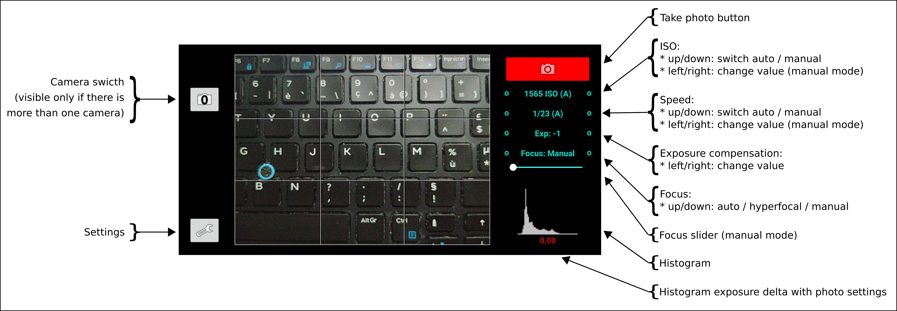

# SimpleRawCamera

Simple photo camera inspired from real camera look.
It use Camera2 API and supports only cameras with full AE / focus control.

Tested only on my LG G6 smartphone.

## Exposure

It support only ISO & Speed (as most smart phone cameras have fixed aperture).

Supported modes:
* Full auto
* Full manual (1 EV step only)
* Semi-automatic (1 EV step only):
  * Manual ISO with automatic Speed
  * Manual Speed with automatic ISO (WARNING: the ISO range is limited and it may not be possible to have one for the specified speed)

## Focus

Supported modes:
* Automatic (continuous)
* Hyper-focal (fixed)
* Manual:
  * Select using the slider
  * Click to focus

## Flash

Not supported yet.
Currently always OFF.

## White balance

Not supported yet.
Currently always AUTO.

## Output modes

* JPEG
* RAW/DNG
* JPEG + RAW/DNG

## Photo mode

* Single shot
* Continuous

## Helpers
* Show rule of third grid
* Show frame for another radio than the sensor

## TODO

* Exposure:
  * Try to adjust exposure (except for full manual mode) to avoid burning highlights
  * Switch from 1 EV step to 1/2 EV step

* Focus:
  * Add face detection

* Optimizations:
  * Continuous photo mode: limit the number of continuous photos to avoid using all the RAM

* Settings:
  * Add "location" option

* Features:
  * Add timer (2 / 10 seconds)
  * Add continuous photo with a timer (every: 1 second, 5 seconds, 10 seconds ... 1 min)

* Flash (not supported yet)
  * Automatic
  * Manual
  * Continuous flash (flashlight)

* White balance (not supported yet)
