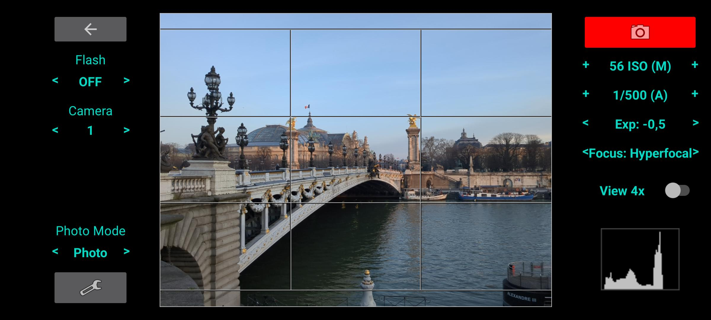

# SimpleRawCamera

* [Screenshots](#screenshots)
* [Exposure](#exposure)
* [Focus](#focus)
* [White balance](#white-balance)
* [Output modes](#output-modes)
* [Photo mode](#photo-mode)
* [Helpers](#helpers)

Simple photo camera inspired from real camera look.
It use Camera2 API and supports only cameras with full AE / focus control.

Tested only on my LG G6 smartphone.

## Screeshots ##
Normal Mode | Timer Mode
--- | ---
 |  

## Exposure ##

It support only ISO & Speed (as most smart phone cameras have fixed aperture).

Supported modes:
* Full auto
* Full manual (1/2 EV step only)
* Semi-automatic (1/2 EV step only):
  * Manual ISO with automatic Speed
  * Manual Speed with automatic ISO (WARNING: the ISO range is limited and it may not be possible to have one for the specified speed)

**NOTE for semi-automatic modes:** My camera supports only full automatic or full manual, but the aperture is fixed so I only have to deal with speed and ISO. To get them I use full autmatic mode for the preview and when I took the photo I calculate the automatic parameter based on the last automatic values and the fixed parameter.

## Focus ##

Supported modes:
* Automatic (continuous)
* Hyper-focal (fixed)
* Manual:
  * Select using the slider
  * Click to focus

## Flash ##

* Flash
  * OFF
  * ON (only on the first photo for continuous photo)
  * Continuous flash (torch)

## White balance ##

Not supported yet. Currently always AUTO.

My smartphoto white balance looks fine and if really needed I change it in post using Free Lightroom Lobile.
## Output modes ##

* JPEG
* RAW/DNG
* JPEG + RAW/DNG

## Photo mode ##

* Single shot
* Continuous
* Timer mode: allow to take photo based on a times

## Helpers ##
* Show rule of third grid
* Show frame for another radio than the sensor
